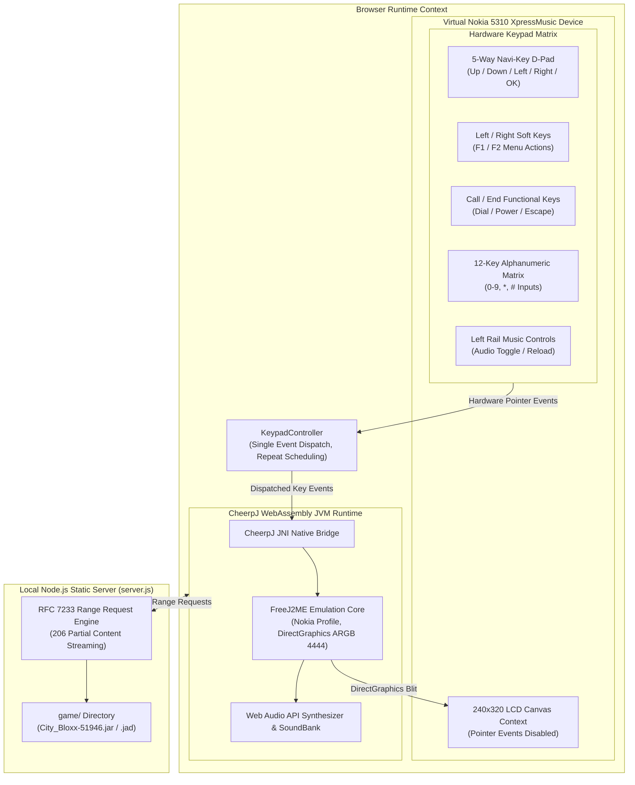

# City Bloxx Web: Nokia 5310 XpressMusic Edition

A browser-based runtime for the J2ME classic City Bloxx, packaged inside an authentic 1:1 replica of the Nokia 5310 XpressMusic mobile phone.

The application renders the original game at an unscaled QVGA resolution of 240x320 pixels and delegates all game inputs strictly to the on-screen physical buttons of the virtual device. External pointer events on the canvas are disabled to reproduce the non-touch hardware experience of the original phone.

---

## Acknowledgments and Attribution

This project is built upon the work of:

- Zbigniew Banach (zb3): Author of [freej2me-web](https://github.com/zb3/freej2me-web), an emscripten and CheerpJ port of FreeJ2ME featuring Canvas 2D graphics acceleration, WebGL M3G / Mascot Capsule 3D pipelines, and WebAssembly audio decoders.
- FreeJ2ME project: Original open-source J2ME emulator developed by recompile.
- Leaning Technologies: Developers of CheerpJ, the client-side Java Virtual Machine for modern web browsers.
- Digital Chocolate: Original creator and developer of City Bloxx (Tower Bloxx).

---

## Technical Architecture



---

## Directory Structure

```
city-bloxx/
├── assets/
│   └── nokia-5310-frame-new.png  # Photographic Nokia 5310 device frame
├── css/
│   └── nokia.css                 # 1:1 Nokia 5310 styling and layout
├── game/
│   ├── City_Bloxx-51946.jar      # J2ME MIDlet archive
│   └── City Bloxx-51946.jad      # Application descriptor (optional)
├── libjs/                        # Native canvas graphics and font shims
├── libmedia/                     # FFmpeg WebAssembly media decoders
├── libmidi/                      # FluidSynth WebAssembly MIDI synthesizer
├── src/
│   ├── eventqueue.js             # J2ME bridge event queue
│   ├── key.js                    # Keycode mapping table
│   └── nokia-app.js              # Device controller and runtime lifecycle
├── freej2me-web.jar              # Compiled FreeJ2ME bridge bytecode
├── index.html                    # Entry point rendering the virtual device
├── server.js                     # Zero-dependency HTTP server with Range support
├── package.json
└── LICENSE                       # MIT License
```

---

## Installation and Execution

### Prerequisites

- Node.js (version 18 or higher recommended)

### Setup

1. Place your game files into the `game/` folder:
   - Path: `game/City_Bloxx-51946.jar` (or any `.jar` file)
   - Path: `game/City Bloxx-51946.jad` (optional `.jad` descriptor)

2. Start the local server:
   ```bash
   npm start
   ```
   Or directly via Node.js:
   ```bash
   node server.js
   ```

3. Navigate to:
   ```
   http://localhost:8080
   ```

The runtime will detect the game archive in the `game/` folder, configure FreeJ2ME with a Nokia platform profile at 240x320 resolution, and boot the game inside the virtual phone screen.

---

## Hardware Controls Mapping

The virtual device provides complete control using on-screen buttons. A synchronized keyboard mapping is also provided for desktop testing:

| Nokia 5310 Control | Game Function | Desktop Keyboard Fallback |
| :--- | :--- | :--- |
| D-Pad Center Button | Drop building block / Select menu item | Enter / Space / Numpad 5 |
| Key 5 (Tactile Pip) | Drop building block / Select menu item | 5 / Numpad 5 |
| D-Pad Up | Cursor up / Menu navigation | Arrow Up / 2 |
| D-Pad Down | Cursor down / Menu navigation | Arrow Down / 8 |
| D-Pad Left | Cursor left / City grid navigation | Arrow Left / 4 |
| D-Pad Right | Cursor right / City grid navigation | Arrow Right / 6 |
| Left Soft Key (LSK) | Menu / Select / Confirm | Q / F1 |
| Right Soft Key (RSK) | Back / Cancel / Exit | W / F2 |
| Green Call Key | Select / Call | Enter |
| Red End Key | Exit / Options menu | Escape |
| Keys 0-9 | Numeric inputs and level shortcuts | 0-9 |
| Star Key (*) | Toggle audio / Special action | E / Numpad * |
| Pound Key (#) | Game info / Help | R / Numpad / |
| Left Rail Play Button | Toggle virtual keyclick sound | Mouse click |
| Left Rail Prev Button | Reload and restart emulator | Mouse click |

---

## Custom Favicon

To use a custom favicon, place your icon file directly into the project root directory:

- File path: `favicon.png` or `favicon.ico`

The HTML template and HTTP server automatically detect and serve this file.

---

## License

This software is released under the terms of the MIT License. See [LICENSE](LICENSE) for details.
